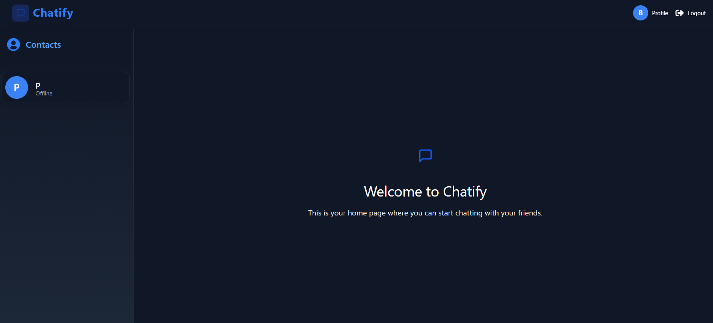
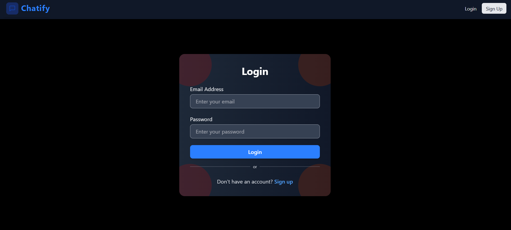

# 💬 Chatify (MERN + Socket.IO)

<p align="center">
	<b>🔐 Authentication • 💬 Real-time messaging • 🟢 Online users • 🖼️ Cloudinary uploads</b><br/>
	Chatify is a full-stack real-time chat app built with Node.js, Express, MongoDB, React (Vite), and Socket.IO.
</p>

<p align="center">
	<a href="https://your-vercel-frontend-url" target="_blank">
		
	</a>
	<a href="https://chatify-backend-4qij.onrender.com" target="_blank">
		
	</a>
	
	
	
	
</p>

---

## 🌐 Live Website

- **Frontend (Vercel):** https://chatify-plum.vercel.app/
- **Backend (Render):** https://chatify-backend-4qij.onrender.com/

---


🚀 A production-ready real-time chat app with a scalable MERN backend and low-latency Socket.IO messaging.

## ✨ Features

- 🔐 Cookie-based JWT authentication (signup/login/logout)
- 💬 Real-time chat with Socket.IO
- 🟢 Online user tracking
- 🖼️ Profile picture upload via Cloudinary
- 🎨 Modern UI (React + Tailwind) with Zustand state management

---

## 🧰 Tech Stack

- **Backend:** Node.js, Express, MongoDB (Mongoose), JWT (cookie-based), Socket.IO
- **Frontend:** React, Vite, Zustand, Axios, Tailwind CSS, Socket.IO Client
- **Media:** Cloudinary (uploads stored in Cloudinary, DB stores image URL)

---

## 📁 Project Structure

```text
LIVE_CHAT/
├── Readme.md
├── Home.png
├── Login.png
├── Backend/                         # Express + MongoDB + Socket.IO
│   ├── src/
│   │   ├── app.js                   # Express app + socket bootstrap
│   │   ├── controllers/
│   │   │   ├── authController.js
│   │   │   └── messageController.js
│   │   ├── routes/
│   │   │   ├── authRoute.js
│   │   │   └── messageRoute.js
│   │   ├── middlewares/
│   │   │   └── authMiddleware.js
│   │   ├── model/
│   │   │   ├── userModel.js
│   │   │   └── messageModel.js
│   │   └── lib/
│   │       ├── cloudinary.js
│   │       ├── socket.js
│   │       └── token.js
│   ├── package.json
│   └── .env.example
└── Frontend/
	└── vite-project/                 # React (Vite) client
		├── src/
		│   ├── Pages/
		│   │   ├── HomePage.jsx
		│   │   ├── LoginPage.jsx
		│   │   ├── ProfilePage.jsx
		│   │   └── SignUpPage.jsx
		│   ├── components/
		│   │   ├── ChatContainer.jsx
		│   │   ├── ChatHeader.jsx
		│   │   ├── MessageInput.jsx
		│   │   ├── Messages.jsx
		│   │   ├── Navbar.jsx
		│   │   ├── NoChatSelected.jsx
		│   │   ├── Sidebar.jsx
		│   │   └── UserChatHeader.jsx
		│   ├── store/
		│   │   ├── authStore.js
		│   │   └── chatStore.js
		│   ├── lib/
		│   │   ├── axios.js
		│   │   └── utils.js
		│   ├── App.jsx
		│   └── main.jsx
		├── public/
		├── vite.config.js
		└── package.json
```
---

## 📸 Preview

### 🏠 Home / Chat


### 🔐 Login


---

## 🚀 Getting Started (Local)

## ✅ Prerequisites

- Node.js installed
- MongoDB connection string (Atlas or local)
- Cloudinary account

### 1) Backend Setup

```bash
cd Backend
npm install
```

Create `Backend/.env` (copy from `Backend/.env.example`):

```bash
copy .env.example .env
```

Start backend:

```bash
npm start
```

### 2) Frontend Setup

```bash
cd Frontend/vite-project
npm install
```

Create `Frontend/vite-project/.env` (copy from `.env.example`):

```bash
copy .env.example .env
```

Start frontend:

```bash
npm run dev
```

---

## 🔑 Environment Variables

### Backend (`Backend/.env`)

| Variable | Required | Description |
| --- | --- | --- |
| `PORT` | ❌ | Server port |
| `MONGODB_URI` | ✅ | MongoDB connection string |
| `secretKey` | ✅ | JWT secret used to sign cookies |
| `CLIENT_URL` | ❌ | Frontend URL allowed by CORS (Vercel domain) |
| `CLOUDINARY_CLOUD_NAME` | ✅ | Cloudinary cloud name |
| `CLOUDINARY_API_KEY` | ✅ | Cloudinary API key |
| `CLOUDINARY_SECRET_KEY` | ✅ | Cloudinary API secret |

### Frontend (`Frontend/vite-project/.env`)

| Variable | Required | Description |
| --- | --- | --- |
| `VITE_API_BASE_URL` | ✅ | Backend API base URL (e.g. `http://localhost:5000/api`) |
| `VITE_SOCKET_URL` | ✅ | Backend socket URL (e.g. `http://localhost:5000`) |

---

## 🚢 Deployment

### Backend (Render)

1. Deploy `Backend/` as a Node service.
2. Set env vars from `Backend/.env` in Render dashboard.
3. Set `CLIENT_URL` = your Vercel frontend domain.

### Frontend (Vercel)

1. Deploy `Frontend/vite-project/`.
2. Set `VITE_API_BASE_URL` and `VITE_SOCKET_URL` to your deployed Render backend URLs.

---

## ⚡ Challenges Faced

- Fixed CORS issues during deployment
- Managed socket connections across environments
- Handled cookie-based authentication in production


## 🧩 Common Issues

- **CORS errors:** make sure backend `CLIENT_URL` matches your deployed frontend domain.
- **Socket not connecting:** ensure `VITE_SOCKET_URL` points to backend.
- **Uploads failing:** verify Cloudinary env vars.

---

## 👨‍💻 Author

Built by Avinash.

